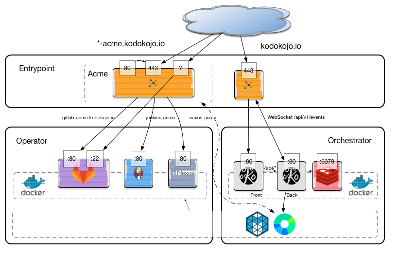

Kodo Kojo alow you to bring a full ready to use software factory. 

You don't want spent your time to setup software factory, setup monitoring tools, add and remove user on each component of yours software factories; Kodo Kojo is done for you. 

Kodo Kojo use the power of [Apache Mesos](http://mesos.apache.org/) and [Marathon](https://mesosphere.github.io/marathon/) via [Docker](https://www.docker.com/) to orchestrate and isolate your software factory tools.

[](https://gitter.im/kodokojo/kodokojo?utm_source=badge&utm_medium=badge&utm_campaign=pr-badge&utm_content=badge)

## License

[](https://gitter.im/kodokojo/kodokojo?utm_source=badge&utm_medium=badge&utm_campaign=pr-badge&utm_content=badge)

`Kodo Kojo` is a licensed under [GNU General Public License v3](http://www.gnu.org/licenses/gpl-3.0.en.html).

## Quickstart
### Step 1 : Clone this repository
```bash
git clone git@github.com:kodokojo/kodokojo.git
cd kodokojo
```

### Step 2 : Retrive and build
```bash
./quickstart.sh
```

Go to [Quicstart page](doc/QUICKSTART.md) to get more details.

## Sofware factory tool supported
* [Gitlab 8.5](http://gitlab.com/) 
* [Jenkins](https://jenkins.io/) now in version 1.651-2-alpine. See Issue #7 to get more detail about Jenkins 2.
* [Nexus OSS 2.13.0-01](http://www.sonatype.com/nexus-repository-oss) 

## Contribute

You want to contribute, it's very Nice.We try to apply this practice [Contribution page](CONTRIBUTE.md).

You may find help on our Slack channel if needed. Don't be afraid about 

## Go further
Following schemas describe how Kodo Kojo and component will be deployed.  



HA Proxy will be managed by [kodokojo-haproxy-marathon](https://github.com/kodokojo/kodokojo-haproxy-marathon) which is register on Marathon event bus. This will allow to update the Ha Proxy configuration when state of Marathon change.

## Stay tuned

You can stay tuned following us on :
* Our Website http://kodokojo.io
* Twitter : [@kodokojo](http://twitter.com/kodokojo)


## Technology inside

* [Java 8](http://java.com)
* [Maven](https://maven.apache.org/)
* [Akka](http://akka.io)
* [Sparkjava](http://sparkjava.com/)
* [Guice](https://github.com/google/guice)
* [Apache Commons](https://commons.apache.org/)
* [Apache Velocity](http://velocity.apache.org/)
* [OkHttp](http://square.github.io/okhttp/)
* [Retrofit](http://square.github.io/retrofit/)
* [Gson](https://github.com/google/gson)

We use following tests tools:
* [Jgiven](http://jgiven.org/)
* [Docker](https://www.docker.com/) with [Docker-Java](https://github.com/docker-java/docker-java)
* [Mockito](http://mockito.org/)
* [AssertJ](http://joel-costigliola.github.io/assertj/)


Thanks to all those Open source project which made possible to done such project!

 
 
