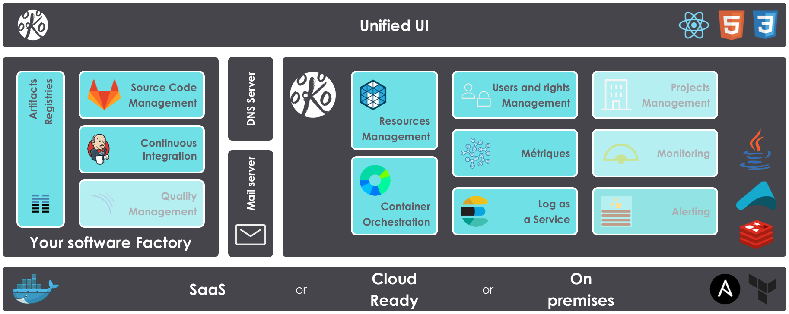

---

Kodo Kojo allows you to get a full out-of-the-box software factory.

If you don't want to spend your time setting up a software factory, its monitoring tools, adding and removing users on each component of your software factories; then Kodo Kojo is made for you.

Kodo Kojo uses the power of [Apache Mesos](http://mesos.apache.org/) and [Marathon](https://mesosphere.github.io/marathon/) via [Docker](https://www.docker.com/) to orchestrate and isolate your software factory tools.

[](https://gitter.im/kodokojo/kodokojo?utm_source=badge&utm_medium=badge&utm_campaign=pr-badge&utm_content=badge)

[](https://github.com/ellerbrock/open-source-badge/) [](http://www.gnu.org/licenses/gpl-3.0.en.html)  [](https://dependencyci.com/github/kodokojo/kodokojo)

License
------

`Kodo Kojo` is licensed under [GNU General Public License v3](http://www.gnu.org/licenses/gpl-3.0.en.html).

Quickstart
------

### Step 0: Requirement

`Kodo kojo` use [Docker](https://www.docker.com/) to run integration tests. So you may need to get **Docker** and **Git** to build `Kodo kojo`.

### Step 1 : Clone this repository

```bash
git clone git@github.com:kodokojo/kodokojo.git
cd kodokojo
```

### Step 2 : Build

`Kodo kojo` will try to access to some containers, like *Redis* or himself (to test HTTP REST endpoint) to run integration test. In this case, `Kodo kojo`need to know her Public IP.
`Kodo kojo` use environment variable `DOCKER_HOST_IP` to create done is request. The default value of `DOCKER_HOST_IP` is `localhost`.

If you use *Docker* from a *Mac* with `docker-machine`, please export public IP of your virtual machine like :
```bash
export DOCKER_HOST_IP=192.168.99.100
```  

If you use *Docker* from *Docker for Mac*, you don't need to configure this value since *Docker for Mac* NAT your container from your `localhost` loopback.
   
```bash
./build.sh
```

This script will try to run tests and build a `kodokojo/kodokojo` *Docker* image. You may find the same script on the [Kodo Kojo UI repository](https://github.com/kodokojo/kodokojo-ui/) to build the UI...

## Supported software factory tools

* [Gitlab 8.13](http://gitlab.com/)
* [Jenkins](https://jenkins.io/) now in version 1.651-3-alpine. See [Issue #7](https://github.com/kodokojo/kodokojo/issues/7) to get more details on Jenkins 2.
* [Nexus OSS 2.13.0-01](http://www.sonatype.com/nexus-repository-oss)

Contribute
------

Want to contribute? That's great! Feel free to read our [Contribution page](CONTRIBUTING.md) to know our guidelines.

You may find help on our [Gitter](https://gitter.im/kodokojo/kodokojo) channel if needed. Don't be afraid to ask.

## Go further

The following diagram describes how Kodo Kojo and its components will be deployed:



HA Proxy will be managed by [kodokojo-haproxy-agent](https://github.com/kodokojo/kodokojo-haproxy-agent) which is registered on Zookeeper.
This will allow the HA Proxy configuration to be updated when a Marathon state changes.

Roadmap
------

We apologize you to visit our [Public Trello roadmap](https://trello.com/b/3xNdZBXq/kodo-kojo-public-roadmap) which allow you to vot to your favorite features.
If a feature not exist, don't hesitated to create an issue.

## Stay tuned

Stay tuned by following us on:

* Our Website http://kodokojo.io
* Twitter : [@kodokojo](http://twitter.com/kodokojo)
* Gitter : [Gitter](https://gitter.im/kodokojo/kodokojo) 

## Technology inside

* [Java 8](http://java.com)
* [Maven](https://maven.apache.org/)
* [Akka](http://akka.io)
* [Sparkjava](http://sparkjava.com/)
* [Guice](https://github.com/google/guice)
* [Apache Commons](https://commons.apache.org/)
* [Java slang](http://www.javaslang.io/)
* [Apache Velocity](http://velocity.apache.org/)
* [OkHttp](http://square.github.io/okhttp/)
* [Retrofit](http://square.github.io/retrofit/)
* [Gson](https://github.com/google/gson)
* [Antlr](http://www.antlr.org/)

We use the following tests tools:

* [Jgiven](http://jgiven.org/)
* [Docker](https://www.docker.com/) with [Docker-Java](https://github.com/docker-java/docker-java)
* [Mockito](http://mockito.org/)
* [AssertJ](http://joel-costigliola.github.io/assertj/)

Thanks to all those Open source projects which made such a project possible!
